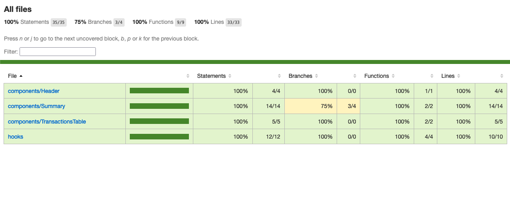

<p align="center">
   
</p>

<p align="center">
</p>

<p align="center">
  :moneybag: Manage your money. Project developed during challenge of ticto | #TICTO
</p>

<div align="center">
  <sub> Made with 💖 by
    <a href="https://github.com/folfer">Victor Calazans Ramos.
  </sub>
</div>

# 📌 Contents

* [Screenshots](#camera-screenshot) 
* [Technologies](#rocket-technologies) 
* [How to Run](#computer-how-to-run)
* [Issues](#bug-issues)
* [Contributing](#sparkles-issues)
* [License](#page_facing_up-license)

# :camera: Screenshots
<div align="center">
   
   
   
   
</div>

# :rocket: Technologies
This project was made using the follow technologies:

* [Typescript](https://www.typescriptlang.org/)      
* [NextJs](https://nextjs.org/)      
* [Styled Components](https://styled-components.com/)
* [SonarQube](https://www.sonarsource.com/products/sonarqube/)
* [StoryBook](https://storybook.js.org/)
* [React Test Library](https://testing-library.com/docs/react-testing-library/intro/)

# :computer: How to run

```bash
# Clone Repository
$ git clone https://github.com/folfer/desafio-ticto
```

```bash
# Install Dependencies
$ yarn

# Run Aplication
$ yarn start

# Run Docker for SonarQube
$ docker-compose up -d

# Run Test
$ yarn test

# Run Test Coverage
$ yarn test:coverage
```

Go to http://localhost:3000/ to see the result Web.
Go to http://localhost:9000/ to see the result Sonar.
Go to http://localhost:6006/ to see the result StoryBook.


# :bug: Issues

Create a <a href="https://github.com/folfer/issues">new issue report</a>, it will be an honor to be able to help you solve and further improve our application.

# :sparkles: Contributing

- Fork this repository;
- Create a branch with your feature: `git checkout -b my-feature`;
- Commit your changes: `git commit -m 'feat: My new feature'`;
- Push to your branch: `git push origin my-feature`.

# :page_facing_up: License

This project is under the [MIT license](./LICENSE).
Made with 💖 by [Victor Calazans](https://www.linkedin.com/in/victorcalazansramos/). 

Thank you! 🌠
